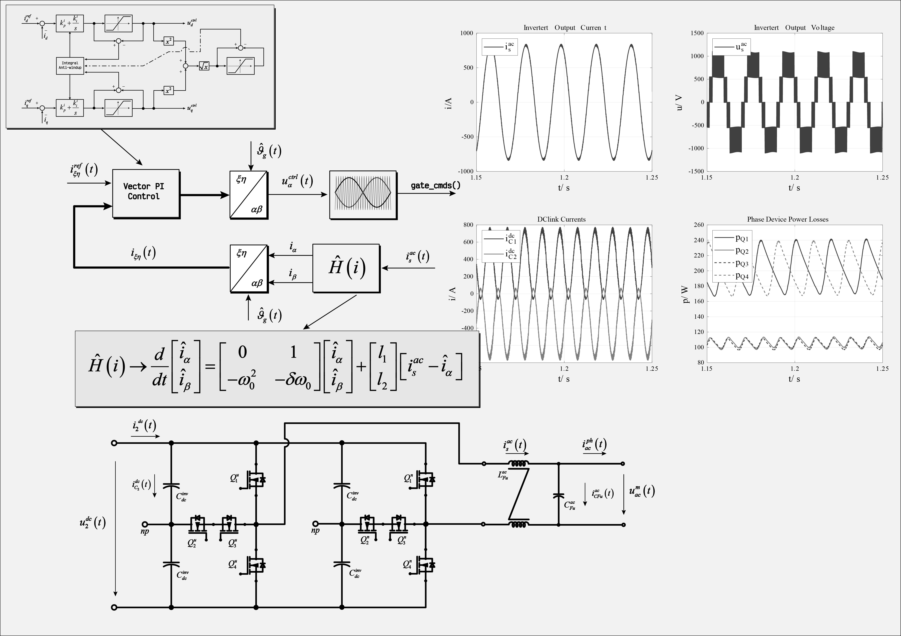
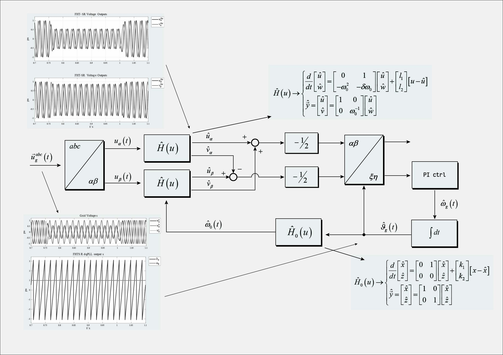
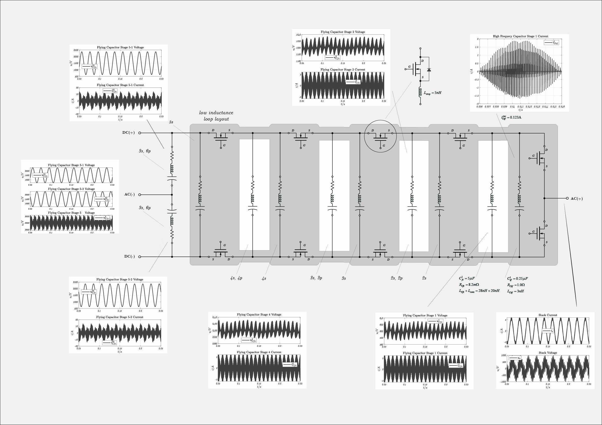
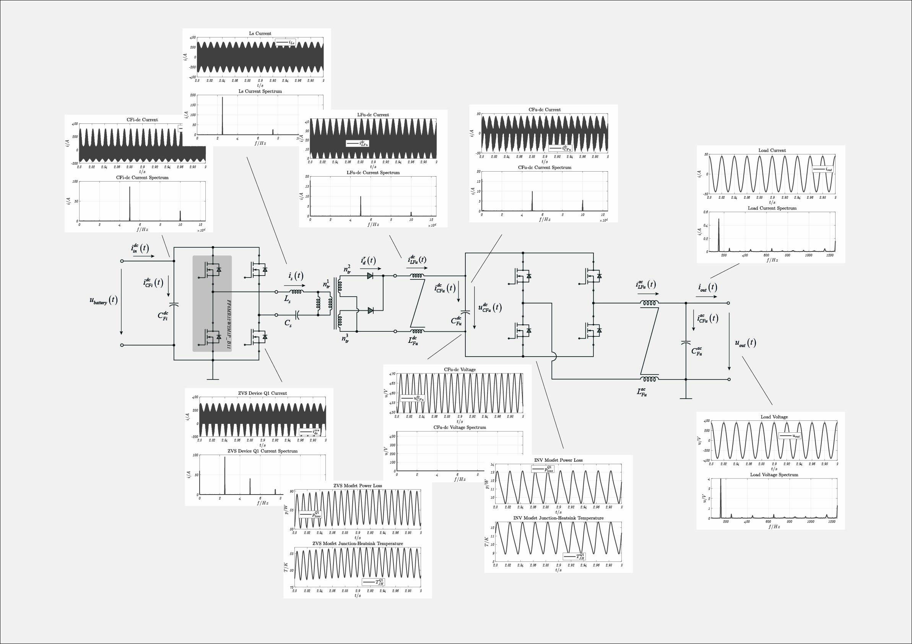
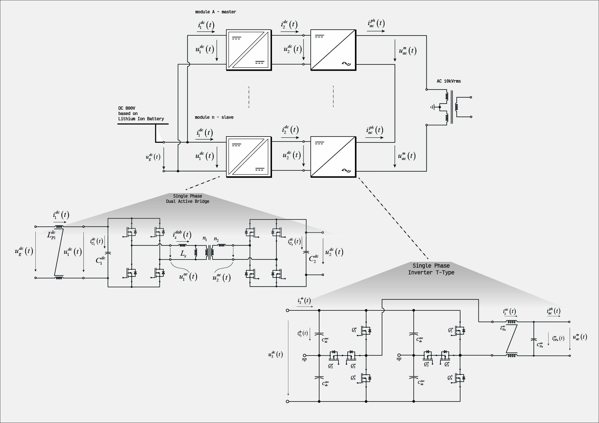

## Power Electronics and Control System Laboratory

<table>
  <tr>
    <td align="center">
       
      <b>Fun with DAB3</b>
    </td>
    <td align="center">
       
      <b>Fun with UPQC</b>
    </td>
  </tr>
  <tr>
    <td align="center">
       
      <b>Fun with FHT-DQ-PLL</b>
    </td>
    <td></td>
  </tr>
</table>

  

  

  

  

  

Here a collection of repos regarding power electronics and control system engineering most developed in Matlab/Simulink/Simscape and C-code.

If you want to use these repositories you must download the repo **library** and added to the matlab path (with subfolders). This repo contains simscape components, masked models, and C-code used into the C-Callers.

Each repository includes a README file with comprehensive instructions for potential users.

<h2 align="left"> Description of the Repositories </h2>

<h3 align="left"> Library </h3>
This repository contains matlab/simscape/library used along all others repositories, and should be added to the matlab path. This repo contains also documents linked by models.

  

<h3 align="left"> Advanced DC/DC Converters </h3>
In this repo we explore and analysis different DCDC configuration like CLLC, Single-Phase-DAB, Three-Phase-DAB.

  

<h3 align="left"> Left-Shunt-Unified-Power-Quality-Conditioner (LS-UPQC) </h3>
Unified Power Quality Conditioner Theory, Design and Control. Ancillary services, voltage stabiliser.

  

<!--  <h3 align="left"> Grid Forming </h3>
This repository contains an analysis and investigations about the design of grid-forming control architectures.

  

 -->

<h3 align="left"> Control of Electrical Machines </h3>
This repository contains and investigations on electrical machine control exploring different control approaches. Electrical machines concerns permanent magnet synchrnous motor and induction motor.

  

<!-- <h3 align="left">Modelization and Control</h3>
This repo contains a collection of projects and models mainly focused on power electronics. There are also some applications in mechanics, specifically for smoothing oscillations on a flexible shaft. Additionally, the repo includes models of semiconductor devices, though these are still under construction.

 -->

<h3 align="left">Solid State Transformers</h3>

  This repository explores different architectures for Solid State Transformers (SST). 
  It is designed to cover the full development cycle, from hardware design to 
  control system implementation.

  

<!-- <h3 align="left">Repos Documentation</h3>

 
  This repository contains open source documentation for all public repositories and library, in particular source documentation for:
  <ul>
    <li>electrification of heavy duty vehicles;</li>
    <li>solid state transformers;</li>
    <li>litium-ion battery modelization;</li>
    <li>PEM fuel cell modelization;</li>
    <li>nonlinear observers - mainly taken from Khalil;</li>
    <li>modelization and vector control of psm;</li>
    <li>modelization and vector control of im;</li>
    <li>some concepts in distributed control and effects of parallelization of active grid rectifiers;</li>
    <li>modelization and control of an flexible shaft;</li>
    <li>modelization and control of hydrostatic equipments and drivelines; </li>
    <li>control of string-actuated. </li>
  </ul>

  

 -->

<h3 align="left">Lectures on advanced control engineering</h3>
Repositories containing resources created for MCI between 2019 and 2023 for Advanced Control Engineering; these resources are still regularly updated.

    
    

