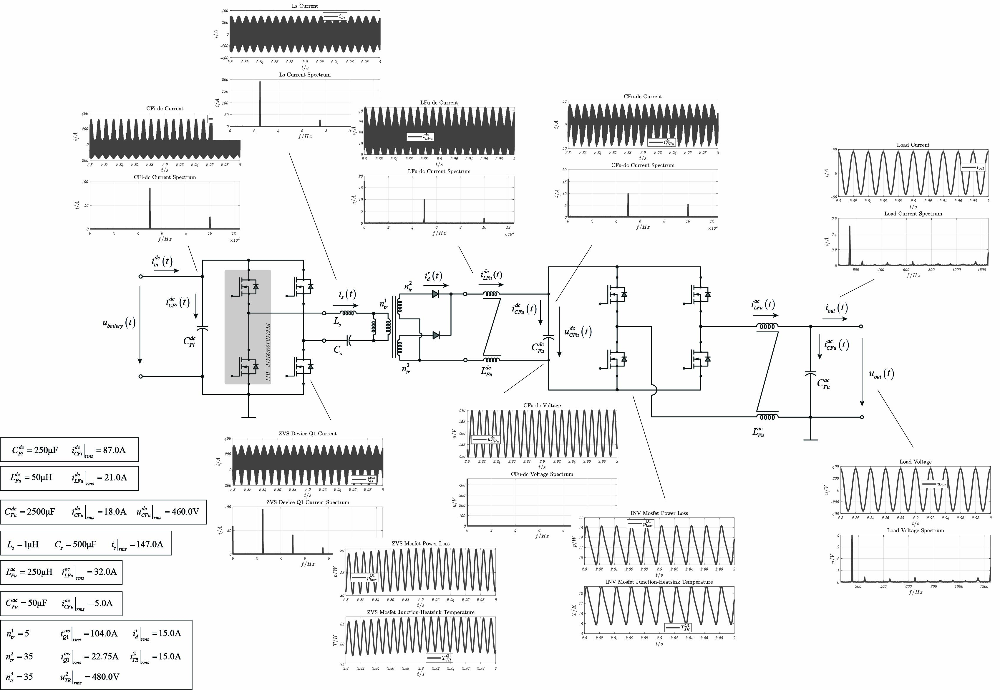

## Power Electronics and Control System Laboratory

  

Here a collection of repos regarding power electronics and control system engineering most developed in Matlab/Simulink/Simscape and C-code.

If you want to use these repositories you must download the repo **library** and added to the matlab path (with subfolders). This repo contains simscape components, masked models, and C-code used into the C-Callers.

Each repository includes a README file with comprehensive instructions for potential users.

<h3 align="center">Main Projects</h3>

  

  

  

  

  

  

  

  
  

